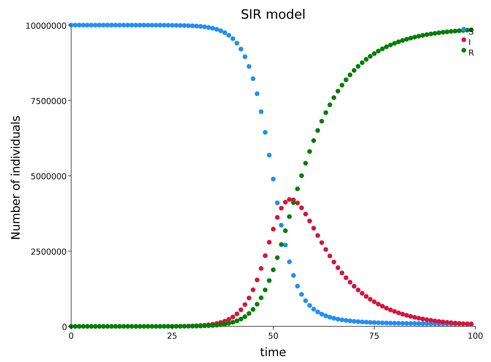
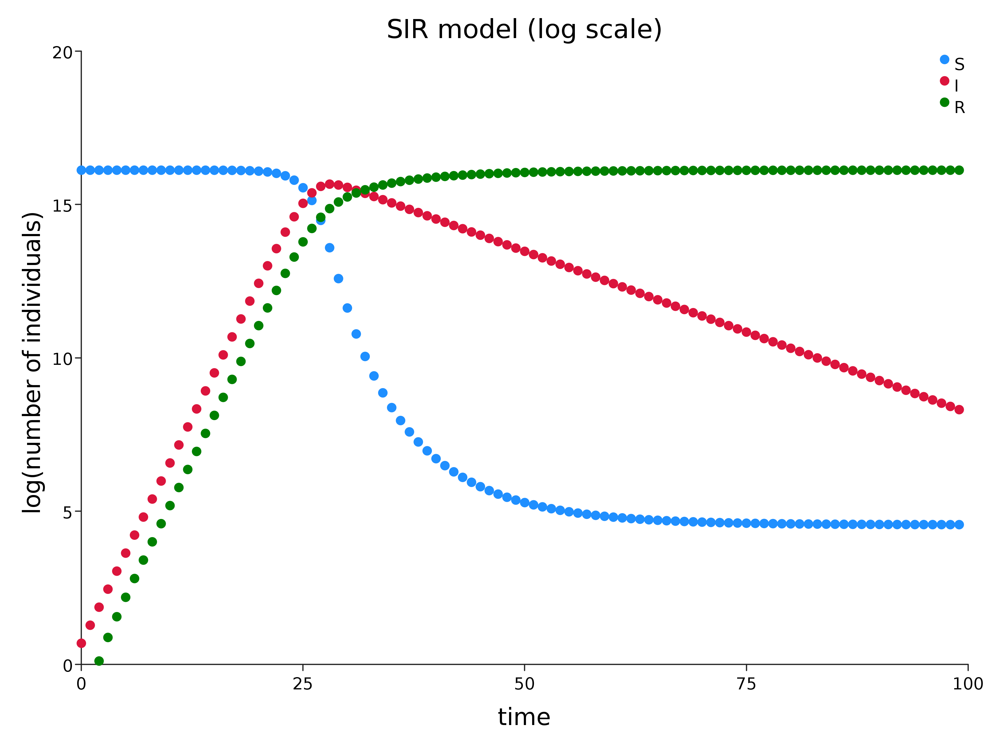

# SIR model

## The SIR model

One of the simplest infectious disease models is the [*Susceptible-Infectious-Removed (SIR) model*](https://en.wikipedia.org/wiki/Compartmental_models_in_epidemiology). As with growth models, individuals can be considered discrete or continuous, time can be considered discrete or continuous, and the dynamics can be deterministic or stochastic. Here, again, we will consider the case of discrete time, continuous individuals and deterministic dynamics in order to keep the maths as simple as possible.

The important extension relative to the simple growth models we looked at is that we now have three compartments: *S*, *I* and *R*.

*S* denotes the susceptibles and *I* the infectious, as before, and *R* represents the individuals who are neither *S* nor *I*. These are typically individuals who were *I* but are now no longer infectious, either because they have recovered or died.

## SIR transition modelling

Suppose that at time $t$ we have $S_t$ susceptibles, $I_t$ infectious and $R_t$ recovered, how should we update these to get these to get the numbers at time $t+1$?

We assume that there are two different processes occurring: the $S\rightarrow I$ transition and the $I\rightarrow R$ transition, and that these processes are happening independently of one another.

### $S\rightarrow I$ transition

Similar to the argument used for logistic growth, we assume that the number of people infected is proportional to both the number of infectious people and the number of susceptibles, to that $\beta S_tI_t$ individuals move from $S$ to $I$. That is, $S_t$ will decrease by this amount and $I_t$ will increase by this amount.

### $I\rightarrow R$ transition

We assume that each infectious individual transitions from $I$ to $R$ at rate $\gamma$, so the number of transitions is $\gamma I_t$.

## Transitions in code

```scala
case class Pop(S: Double, I: Double, R: Double)
val p0 = Pop(1.0e7, 2.0, 0.0)
// p0: Pop = Pop(1.0E7, 2.0, 0.0)
def S2I(beta: Double)(p: Pop): Pop = {
  val si = beta * p.S * p.I
  p.copy(S = p.S - si, I = p.I + si)
}
def I2R(gamma: Double)(p: Pop): Pop = {
  val ir = gamma * p.I
  p.copy(I = p.I - ir, R = p.R + ir)
}
def update(beta: Double, gamma: Double)(p: Pop): Pop =
  I2R(gamma)(S2I(beta)(p))
  
update(0.001, 0.01)(p0)
// res0: Pop = Pop(9980000.0, 19801.98, 200.02)
```

## Population dynamics

```scala
val pop = Stream.iterate(p0)(update(1.0e-7, 0.1))
```
```scala
pop.take(8).toList
// res1: List[Pop] = List(
//   Pop(1.0E7, 2.0, 0.0),
//   Pop(9999998.0, 3.6, 0.4),
//   Pop(9999994.40000072, 6.479999352, 1.119999928),
//   Pop(9999987.920004996, 11.663995567680747, 2.415999435520083),
//   Pop(9999976.256023519, 20.995179340734605, 4.74879714004615),
//   Pop(9999955.260894028, 37.791277947508284, 8.947828023102627),
//   Pop(9999917.469785156, 68.02414813819591, 16.506066705124397),
//   Pop(9999849.446198422, 122.4429613844722, 30.110840192287974)
// )
```

## Plot



## Log plot




