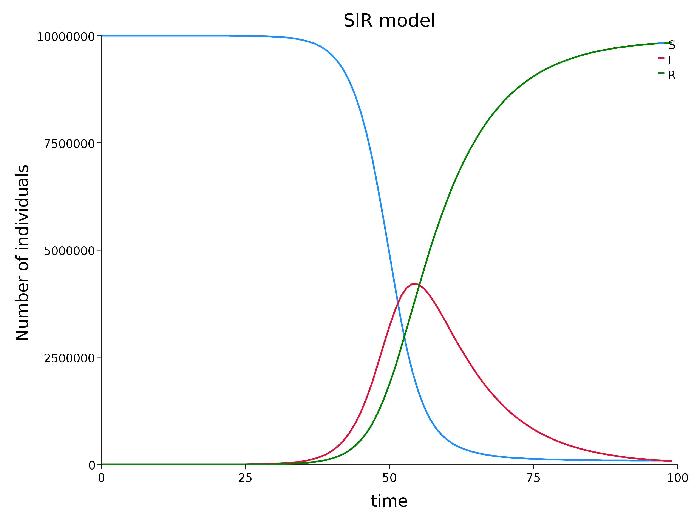
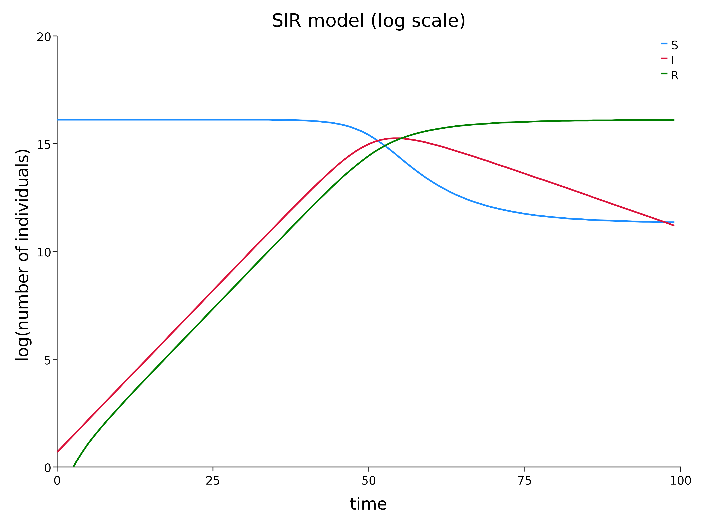

# SIR model

## The SIR model

One of the simplest infectious disease models is the [*Susceptible-Infectious-Removed (SIR) model*](https://en.wikipedia.org/wiki/Compartmental_models_in_epidemiology). As with growth models, individuals can be considered discrete or continuous, time can be considered discrete or continuous, and the dynamics can be deterministic or stochastic. Here, again, we will consider the case of discrete time, continuous individuals and deterministic dynamics in order to keep the maths as simple as possible.

The important extension relative to the simple growth models we looked at is that we now have three compartments: *S*, *I* and *R*.

*S* denotes the susceptibles and *I* the infectious, as before, and *R* represents the individuals who are neither *S* nor *I*. These are typically individuals who were *I* but are now no longer infectious, because they have been isolated, have recovered, or died.

## SIR transition modelling

Suppose that at time $t$ we have $S_t$ susceptibles, $I_t$ infectious and $R_t$ recovered, how should we update these to get these to get the numbers at time $t+1$?

We assume that there are two different processes occurring: the $S\rightarrow I$ transition and the $I\rightarrow R$ transition, and that these processes are happening independently of one another.

### $S\rightarrow I$ transition

Similar to the argument used for logistic growth, we assume that the number of people infected is proportional to both the number of infectious people and the number of susceptibles, to that $\beta S_tI_t$ individuals move from $S$ to $I$. That is, $S_t$ will decrease by this amount and $I_t$ will increase by this amount.

### $I\rightarrow R$ transition

We assume that each infectious individual transitions from $I$ to $R$ at rate $\gamma$, so the number of transitions is $\gamma I_t$.

## Transitions in code

```scala
case class Pop(S: Double, I: Double, R: Double)
val p0 = Pop(1.0e7, 2.0, 0.0)
// p0: Pop = Pop(1.0E7, 2.0, 0.0)
def S2I(beta: Double)(p: Pop): Pop = {
  val si = beta * p.S * p.I
  p.copy(S = p.S - si, I = p.I + si)
}
def I2R(gamma: Double)(p: Pop): Pop = {
  val ir = gamma * p.I
  p.copy(I = p.I - ir, R = p.R + ir)
}
def update(beta: Double, gamma: Double)(p: Pop): Pop =
  I2R(gamma)(S2I(beta)(p))
  
update(0.001, 0.01)(p0)
// res0: Pop = Pop(9980000.0, 19801.98, 200.02)
```

## Population dynamics

```scala
val beta = 5.0e-8; val gamma = 0.1
val pop = Stream.iterate(p0)(update(beta, gamma))
```
```scala
pop.take(8).toList
// res1: List[Pop] = List(
//   Pop(1.0E7, 2.0, 0.0),
//   Pop(9999999.0, 2.7, 0.30000000000000004),
//   Pop(9999997.650000134, 3.6449998785, 0.7049999865000001),
//   Pop(9999995.827500623, 4.9207494505162845, 1.251749925446254),
//   Pop(9999993.367126925, 6.643010834264904, 1.9898622403645767),
//   Pop(9999990.04562371, 8.968062643456474, 2.9863136451930736),
//   Pop(9999985.561596852, 12.106880551450082, 4.331522595354194),
//   Pop(9999979.508165317, 16.34428087827661, 6.147553804051595)
// )
```

## Plot



## Log plot



## Basic reproduction number, $R_0$

If we think about how the number of infectious individuals, $I$, evolves, it is clearly increased by the infection process and decreased by the removal process. If these two processes are applied in parallel (as opposed to sequentially, as we did), then the change in $I$ at time $t$ is
$$ I_{t+1}-I_t = \beta S_tI_t - \gamma I_t = \left(\frac{\beta S_t}{\gamma} - 1\right)\gamma I_t $$
Near the start of the epidemic, $S_t\simeq N$, the total population size, and so
$$ I_{t+1}-I_t \simeq \left(\frac{\beta N}{\gamma} - 1\right)\gamma I_t $$
So, if $\beta N/\gamma > 1$, then the number of infectious individuals will increase exponentially.

$\beta N/\gamma$ is known as the [*basic reproduction number*](https://en.wikipedia.org/wiki/Basic_reproduction_number), and is often denoted $R_0$, which is confusing, since it is not the initial number of removed. It can be interpreted as the average number of individuals that each infectious person will infect before removal.

## Flattening the curve

There are different ways to parametrise the SIR model, but the way we have done it, our basic reproduction number is
$$
R_0 = \frac{\beta N}{\gamma}
$$
```scala
val R0 = beta * p0.S / gamma
// R0: Double = 5.0
```
Since $N$ is fixed, $R_0$ is reduced by reducing the infection rate $\beta$, or increasing the removal rate $\gamma$.

So-called "social distancing" policies reduce $\beta$, and strict self-isolation policies increase $\gamma$. Note that $1/\gamma$ is the average time before an infectious individual is removed from the population.

```scala
val popF = Stream.iterate(p0)(
    update(0.6 * beta, 1.2 * gamma))
```

## Reduced $\beta$ and increased $\gamma$


# SEIR model

## SEIR model

One potential issue with the SIR model is that it assumes that individuals become infectious as soon as they are infected. This may be a reasonable approximation for some diseases, but some diseases have a significant latent period between when an individual becomes infected and when they become infectious. 

The SEIR model addresses this problem by introducing an additional population class, *Exposed* (*E*), between *S* and *I*. So infected individuals initially transition from *S* to *E*, at rate $\beta S I$, as previously discussed. Then *E* individuals transition to *I* at rate $a E$, where $1/a$ is the average incubation period.
