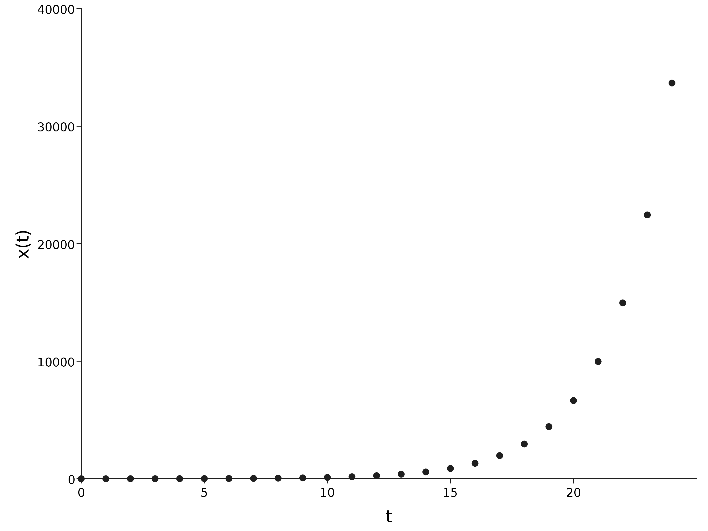
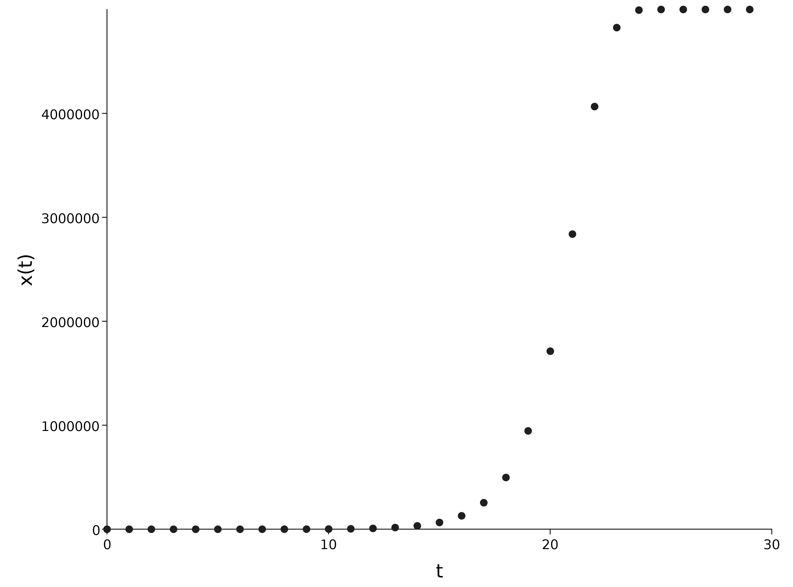
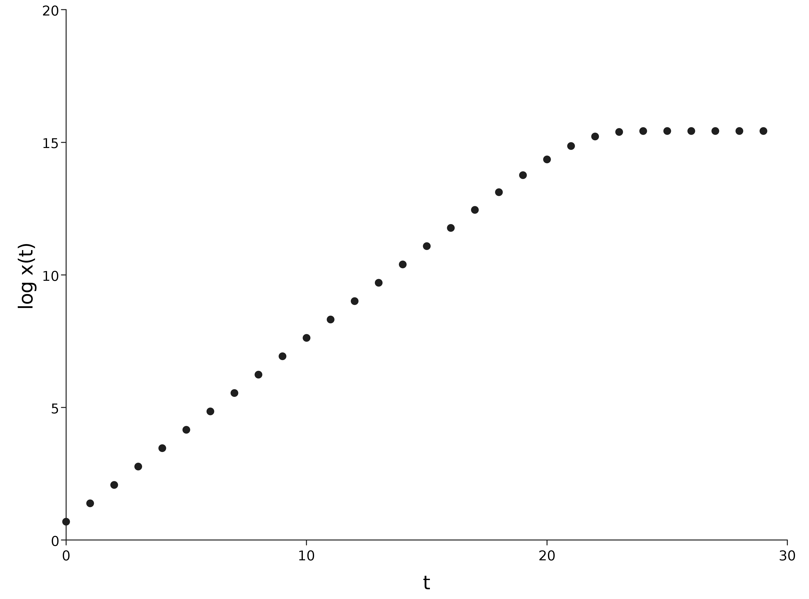

# Exponential models

## Exponential growth

Time and population size can be continuous or discrete, and processes can be considered deterministic or stochastic.

## Discrete time, deterministic dynamics

In the early stages of an epidemic, most people are susceptible to the disease, so in a random interaction between an infectious person and another person, that other person is very likely to be susceptible. In that case we shall assume that each infectious person infects $s$ susceptibles per day, for some parameter $s$ related to how infectious the disease is (and lots of other things, such as population density, behaviour, etc.), and that they then cease to be infectious.

If we start with $x_0$ infectious individuals on day 0, we will have $x_1 = x_0\times s$ on day 1, $x_2 = x_1 \times s$ on day 2, etc.

## Time course as a stream

The relationship between $x_t$ and $x_{t-1}$ (for *any* $t$) gives us a way to compute $x_t$ (for some *specific* $t$) from $x_0$, either recursively or iteratively. 

### Some Scala code

```scala
val x0 = 3; val s = 2
val xs = Stream.iterate(x0)(xt => xt*s)
```

```scala
xs.take(5).toList
// res0: List[Int] = List(3, 6, 12, 24, 48)
```

## Continuous approximation to population size

Of course, there is no reason to assume that the "average" number of people infected each day is an integer, so to model the "expected" size of the infected population, we must switch to `Double`s.

```scala
val x0 = 2.0; val s = 1.5
val xs = Stream.iterate(x0)(xt => xt*s)
```

```scala
xs.take(4).toList
// res2: List[Double] = List(2.0, 3.0, 4.5, 6.75)
```
This just confirms the closed-form solution of this model:

$$x_t=x_0s^t.$$

## Plot using [EvilPlot](https://cibotech.github.io/evilplot/)

```scala
import com.cibo.evilplot._
import com.cibo.evilplot.plot._
import com.cibo.evilplot.plot.aesthetics.DefaultTheme._
import com.cibo.evilplot.numeric.Point

val points = xs.zipWithIndex.
  map{case (xt, t) => Point(t, xt)}.
  take(25).toList

ScatterPlot(points)
  .xAxis()
  .yAxis()
  .frame()
  .xLabel("t")
  .yLabel("x(t)")
  .render()
```
## Plot of $x_t$ against $t$



## Geometric growth, exponential growth, and logarithms

The number of infected people in this model is said to follow a *geometric* sequence. So the growth in such a sequence should probably be referred to as *geometric growth*. However, this is just the discrete time version of [exponential growth](https://en.wikipedia.org/wiki/Exponential_growth). The growth is said to be exponential because it can be described by an exponential curve. Since [logarithms](https://en.wikipedia.org/wiki/Logarithm) are the inverse of exponential functions, the logarithm of values in a geometric series have *arithmetic* or *linear* growth.

This is why people often use a logarithmic $y$-axis on epidemic plots. Transforming our recurrence $x_t = sx_{t-1}$ gives 
$$\log x_t = \log s + \log x_{t-1}.$$
Similarly, transforming the solution $x_t = x_0s^t$ gives
$$\log x_t = \log x_0 + t\log s.$$

## Continuous time, and stochastic infections

### Continuous time

Rather than modelling one day at a time, it is sometimes better to think about events playing out in continuous time. This leads to a linear differential equation whose solution is the exponential function.

### Discrete stochastic updates

Alternatively, we can stick with discrete time, but insist on an integer number of infected individuals at each time. The best way to do this is by assuming that the number of individuals infected at each time is a discrete random quantity, described by a *binomial* or *Poisson* distribution.

### Continuous time and discrete stochastic updates

In fact, it is often better still to have a continuous time model with discrete stochastic infection events, where the time between infections is described by a continous random quantity such as an *exponential* distribution.

# Logistic models

## Logistic growth

Exponential growth models capture the behaviour of the early part of an epidemic quite well, but an obvious limitation is that they continue to grow very quickly, so before long they will be predicting more people infected than there are people on Earth.

A simple extension is to suppose that the population size is fixed, and that the number of susceptibles is just the number not currently infected. We then suppose that the number of new infections relates to the number of susceptibles in an intuitive way.

At time $t$ the number infected is $x_t$, so the number of susceptibles is $P-x_t$, where $P$ is the population size. We now assume that $r$ is the propensity for any infectious individual to infect any susceptible, so the number of infections from each infectious individual is $r\times(P-x_t)$ (so approximately $s=rP$), and the total number infected at the next time point will be $x_t\times r\times(P-x_t)$. In other words,
$$ x_{t+1} = rx_t(P-x_t).$$
This is the so-called *logistic map*.

## Logistic map

```scala
val x0 = 2.0; val r = 2.0e-7; val P = 1.0e7
val xs = Stream.iterate(x0)(xt => r*xt*(P-xt))
```

```scala
xs.take(4).toList
// res6: List[Double] = List(
//   2.0,
//   3.9999992,
//   7.999995200001278,
//   15.999977600017914
// )
```
So for an appropriate choice of $r$, the early behaviour of this epidemic is very similar to that of the exponential growth model. The differences kick in later in the epidemic.

## Plot



## Log Plot


