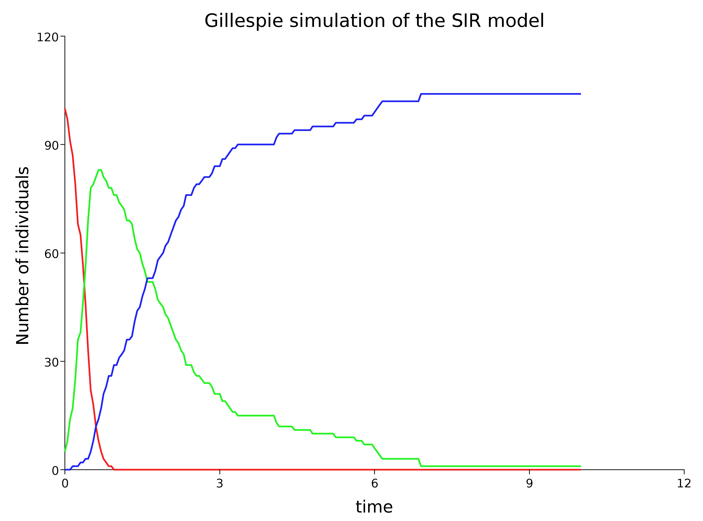

# Abstracting model structure from simulation approach

## The structure on an SIR model

Blah

```scala
import smfsb._
import breeze.linalg._
import breeze.numerics._
```


```scala
val dMod = SpnModels.sir[IntState]()
// dMod: Spn[IntState] = UnmarkedSpn(
//   List("S", "I", "R"),
//   1  1  0  
// 0  1  0  ,
//   0  2  0  
// 0  0  1  ,
//   smfsb.SpnModels$$$Lambda$5366/1227579254@567178df
// )
val stepSIRds = Step.gillespie(dMod)
// stepSIRds: (IntState, Time, Time) => IntState = smfsb.Step$$$Lambda$5367/697673306@52163f78
val tsSIRds = Sim.ts(DenseVector(100,5,0), 0.0, 10.0, 0.05, stepSIRds)
// tsSIRds: Ts[IntState] = List(
//   (0.0, DenseVector(100, 5, 0)),
//   (0.05, DenseVector(94, 11, 0)),
//   (0.1, DenseVector(91, 14, 0)),
//   (0.15000000000000002, DenseVector(84, 21, 0)),
//   (0.2, DenseVector(73, 32, 0)),
//   (0.25, DenseVector(60, 43, 2)),
//   (0.3, DenseVector(47, 53, 5)),
//   (0.35, DenseVector(39, 61, 5)),
//   (0.39999999999999997, DenseVector(26, 74, 5)),
//   (0.44999999999999996, DenseVector(18, 80, 7)),
//   (0.49999999999999994, DenseVector(15, 82, 8)),
//   (0.5499999999999999, DenseVector(10, 86, 9)),
//   (0.6, DenseVector(4, 89, 12)),
//   (0.65, DenseVector(2, 88, 15)),
//   (0.7000000000000001, DenseVector(1, 88, 16)),
//   (0.7500000000000001, DenseVector(1, 87, 17)),
//   (0.8000000000000002, DenseVector(1, 86, 18)),
//   (0.8500000000000002, DenseVector(0, 84, 21)),
//   (0.9000000000000002, DenseVector(0, 83, 22)),
//   (0.9500000000000003, DenseVector(0, 80, 25)),
//   (1.0000000000000002, DenseVector(0, 78, 27)),
//   (1.0500000000000003, DenseVector(0, 77, 28)),
//   (1.1000000000000003, DenseVector(0, 75, 30)),
//   (1.1500000000000004, DenseVector(0, 73, 32)),
//   (1.2000000000000004, DenseVector(0, 73, 32)),
//   (1.2500000000000004, DenseVector(0, 73, 32)),
//   (1.3000000000000005, DenseVector(0, 69, 36)),
//   (1.3500000000000005, DenseVector(0, 68, 37)),
//   (1.4000000000000006, DenseVector(0, 67, 38)),
//   (1.4500000000000006, DenseVector(0, 65, 40)),
//   (1.5000000000000007, DenseVector(0, 64, 41)),
//   (1.5500000000000007, DenseVector(0, 62, 43)),
//   (1.6000000000000008, DenseVector(0, 60, 45)),
//   (1.6500000000000008, DenseVector(0, 58, 47)),
//   (1.7000000000000008, DenseVector(0, 56, 49)),
//   (1.7500000000000009, DenseVector(0, 54, 51)),
//   (1.800000000000001, DenseVector(0, 53, 52)),
//   (1.850000000000001, DenseVector(0, 49, 56)),
//   (1.900000000000001, DenseVector(0, 47, 58)),
//   (1.950000000000001, DenseVector(0, 46, 59)),
//   (2.000000000000001, DenseVector(0, 46, 59)),
//   (2.0500000000000007, DenseVector(0, 46, 59)),
//   (2.1000000000000005, DenseVector(0, 46, 59)),
//   (2.1500000000000004, DenseVector(0, 44, 61)),
//   (2.2, DenseVector(0, 44, 61)),
//   (2.25, DenseVector(0, 44, 61)),
//   (2.3, DenseVector(0, 42, 63)),
//   (2.3499999999999996, DenseVector(0, 42, 63)),
// ...
plotTs(tsSIRds, "Gillespie simulation of the SIR model")
// res0: geometry.Drawable = Group(
//   Vector(
//     Translate(
//       StrokeStyle(
//         Group(
//           Vector(
//             Translate(Rotate(Line(516.0, 1.0), 90.0), -0.5000000000000158, 0.0),
//             Translate(Line(736.2783203125, 1.0), 0.0, 515.5)
//           )
//         ),
//         HSLA(0.0, 0.0, 12.0, 1.0)
//       ),
//       63.72167968750004,
//       33.0
//     ),
//     Translate(
//       Group(
//         Vector(
//           Resize(
//             LineDash(
//               StrokeStyle(
//                 Translate(
//                   Path(
//                     Vector(
//                       Point(0.0, 0.0),
//                       Point(3.067826334635417, 25.80000000000001),
//                       Point(6.135652669270834, 38.69999999999999),
//                       Point(9.203479003906251, 68.80000000000001),
//                       Point(12.271305338541667, 116.10000000000002),
//                       Point(15.339131673177084, 172.0),
//                       Point(18.4069580078125, 227.89999999999998),
//                       Point(21.474784342447915, 262.3),
//                       Point(24.54261067708333, 318.2),
//                       Point(27.610437011718748, 352.6),
//                       Point(30.678263346354164, 365.5),
//                       Point(33.74608968098958, 387.0),
//                       Point(36.813916015625, 412.8),
//                       Point(39.88174235026042, 421.4),
//                       Point(42.94956868489584, 425.7),
//                       Point(46.01739501953126, 425.7),
//                       Point(49.08522135416668, 425.7),
//                       Point(52.1530476888021, 430.0),
//                       Point(55.22087402343752, 430.0),
//                       Point(58.28870035807294, 430.0),
//                       Point(61.35652669270835, 430.0),
//                       Point(64.42435302734377, 430.0),
//                       Point(67.49217936197918, 430.0),
//                       Point(70.56000569661461, 430.0),
//                       Point(73.62783203125002, 430.0),
// ...
```

## Plot


```scala
val cMod = SpnModels.sir[DoubleState]()
// cMod: Spn[DoubleState] = UnmarkedSpn(
//   List("S", "I", "R"),
//   1  1  0  
// 0  1  0  ,
//   0  2  0  
// 0  0  1  ,
//   smfsb.SpnModels$$$Lambda$5366/1227579254@6d62a318
// )
val stepSIRcd = Step.euler(cMod)
// stepSIRcd: (DoubleState, Time, Time) => DoubleState = smfsb.Step$$$Lambda$5581/250589252@17f313c1
```

## SEIR

```scala
val stepSEIR = Step.gillespie(SpnModels.seir[IntState]())
// stepSEIR: (IntState, Time, Time) => IntState = smfsb.Step$$$Lambda$5367/697673306@5bf2b019
val tsSEIR = Sim.ts(DenseVector(100,5,0,0), 0.0, 20.0, 0.05, stepSEIR)
// tsSEIR: Ts[IntState] = List(
//   (0.0, DenseVector(100, 5, 0, 0)),
//   (0.05, DenseVector(100, 5, 0, 0)),
//   (0.1, DenseVector(100, 5, 0, 0)),
//   (0.15000000000000002, DenseVector(100, 5, 0, 0)),
//   (0.2, DenseVector(100, 5, 0, 0)),
//   (0.25, DenseVector(100, 5, 0, 0)),
//   (0.3, DenseVector(100, 5, 0, 0)),
//   (0.35, DenseVector(100, 5, 0, 0)),
//   (0.39999999999999997, DenseVector(100, 5, 0, 0)),
//   (0.44999999999999996, DenseVector(100, 5, 0, 0)),
//   (0.49999999999999994, DenseVector(100, 5, 0, 0)),
//   (0.5499999999999999, DenseVector(100, 5, 0, 0)),
//   (0.6, DenseVector(100, 5, 0, 0)),
//   (0.65, DenseVector(100, 5, 0, 0)),
//   (0.7000000000000001, DenseVector(100, 5, 0, 0)),
//   (0.7500000000000001, DenseVector(100, 5, 0, 0)),
//   (0.8000000000000002, DenseVector(100, 5, 0, 0)),
//   (0.8500000000000002, DenseVector(100, 5, 0, 0)),
//   (0.9000000000000002, DenseVector(100, 5, 0, 0)),
//   (0.9500000000000003, DenseVector(99, 5, 1, 0)),
//   (1.0000000000000002, DenseVector(99, 5, 1, 0)),
//   (1.0500000000000003, DenseVector(99, 5, 1, 0)),
//   (1.1000000000000003, DenseVector(98, 6, 1, 0)),
//   (1.1500000000000004, DenseVector(98, 6, 1, 0)),
//   (1.2000000000000004, DenseVector(97, 7, 1, 0)),
//   (1.2500000000000004, DenseVector(97, 7, 1, 0)),
//   (1.3000000000000005, DenseVector(96, 8, 1, 0)),
//   (1.3500000000000005, DenseVector(96, 8, 1, 0)),
//   (1.4000000000000006, DenseVector(96, 8, 1, 0)),
//   (1.4500000000000006, DenseVector(96, 8, 1, 0)),
//   (1.5000000000000007, DenseVector(96, 8, 1, 0)),
//   (1.5500000000000007, DenseVector(96, 8, 1, 0)),
//   (1.6000000000000008, DenseVector(96, 8, 1, 0)),
//   (1.6500000000000008, DenseVector(94, 10, 1, 0)),
//   (1.7000000000000008, DenseVector(93, 11, 1, 0)),
//   (1.7500000000000009, DenseVector(93, 11, 1, 0)),
//   (1.800000000000001, DenseVector(92, 12, 1, 0)),
//   (1.850000000000001, DenseVector(91, 13, 1, 0)),
//   (1.900000000000001, DenseVector(91, 13, 1, 0)),
//   (1.950000000000001, DenseVector(90, 14, 1, 0)),
//   (2.000000000000001, DenseVector(90, 14, 0, 1)),
//   (2.0500000000000007, DenseVector(90, 13, 1, 1)),
//   (2.1000000000000005, DenseVector(90, 13, 1, 1)),
//   (2.1500000000000004, DenseVector(89, 14, 1, 1)),
//   (2.2, DenseVector(89, 14, 1, 1)),
//   (2.25, DenseVector(89, 14, 1, 1)),
//   (2.3, DenseVector(88, 15, 1, 1)),
//   (2.3499999999999996, DenseVector(88, 15, 0, 2)),
// ...
```


