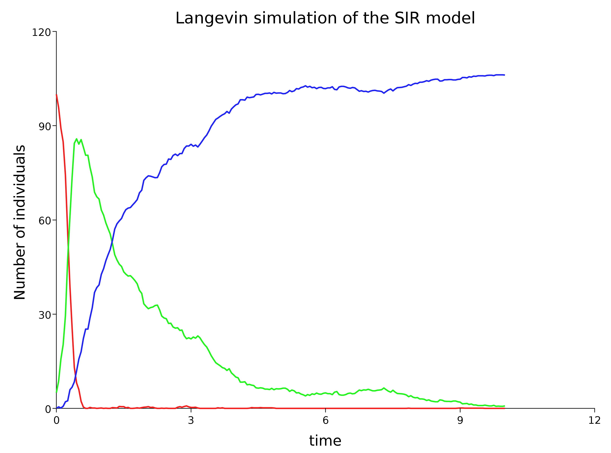
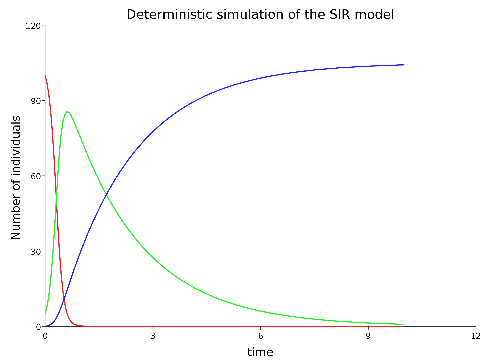
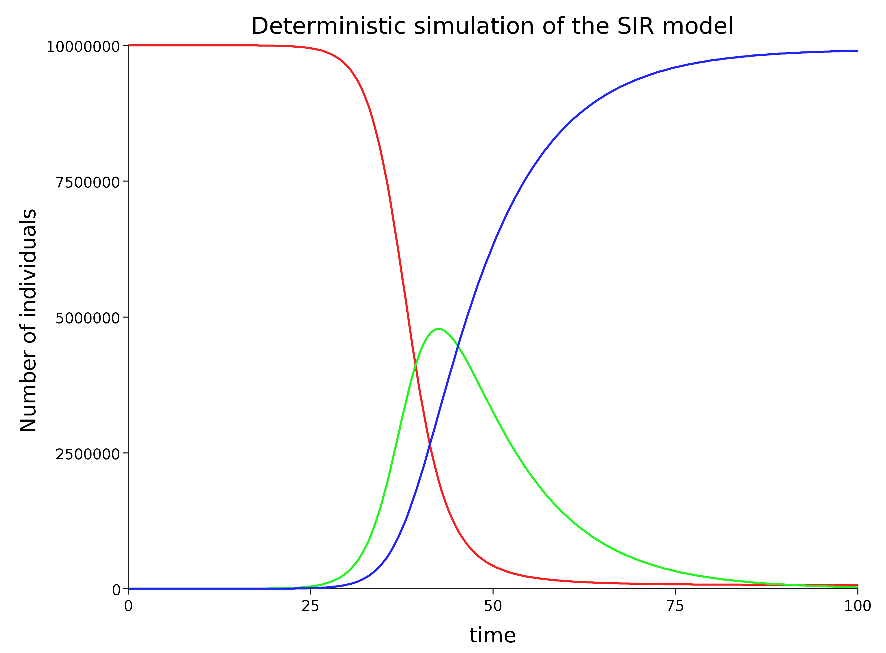
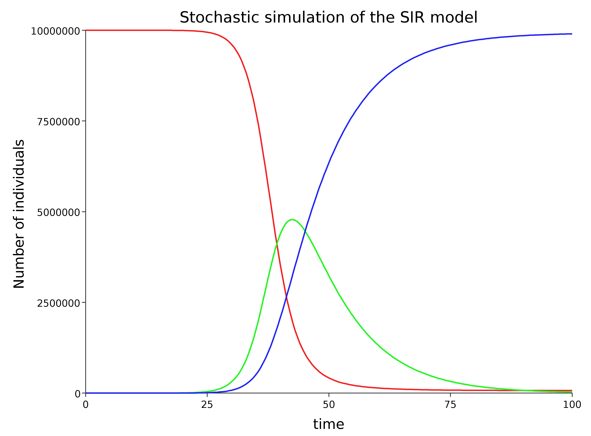
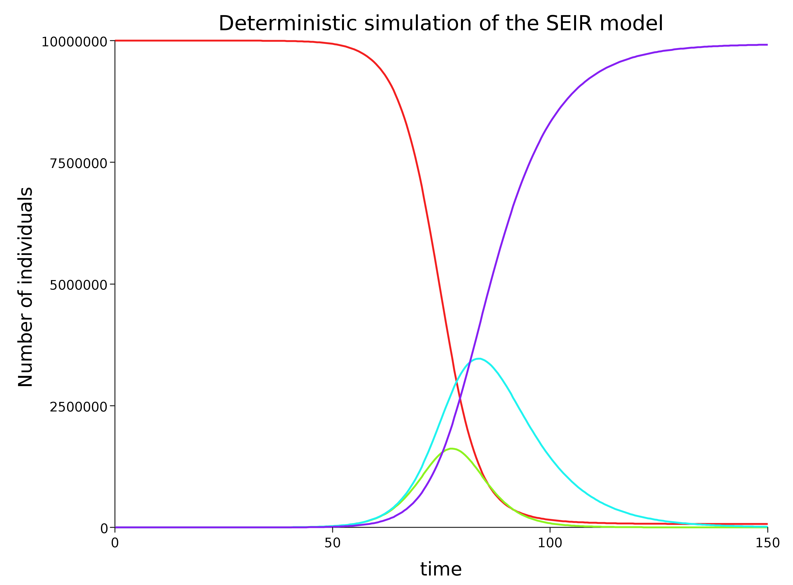

# Abstracting model structure from simulation approach

## The structure of an SIR model

We will use my library, [`scala-smfsb`](https://github.com/darrenjw/scala-smfsb), associated with [*my book*](https://github.com/darrenjw/smfsb/blob/master/README.md). SIR and SEIR models are included in the library. The library uses a [*Petri net*](https://en.wikipedia.org/wiki/Petri_net) approach to separate the representation of the structure of the model from the method we use to simulate its dynamics.

```scala
import smfsb._
import breeze.linalg._
import breeze.numerics._
```
```scala
val dMod = SpnModels.sir[IntState]()
// dMod: Spn[IntState] = UnmarkedSpn(
//   List("S", "I", "R"),
//   1  1  0  
// 0  1  0  ,
//   0  2  0  
// 0  0  1  ,
//   smfsb.SpnModels$$$Lambda$6804/1472082550@ddbd20f
// )
```


## Simulation

We can feed a model into a simulation algorithm and get back a function (closure) for simulating from the dynamics of the process. We can then feed this function for simulating from the transition kernel of the process into a function that unfolds the dynamics into a time series of system states.

```scala
val stepSIRds = Step.gillespie(dMod)
// stepSIRds: (IntState, Time, Time) => IntState = smfsb.Step$$$Lambda$6805/632352775@33ac173
```
```scala
val tsSIRds = Sim.ts(DenseVector(100,5,0), 0.0, 10.0,
	0.05, stepSIRds)
```	
```scala
import Sim.plotTs
plotTs(tsSIRds, "Gillespie simulation of the SIR model")
```

## Plot (exact discrete stochastic dynamics)


# Approximate simulation algorithms

## Approximating the discrete stochastic dynamics

The [*Gillespie algorithm*](https://en.wikipedia.org/wiki/Gillespie_algorithm) simulates every transition event explicitly. This leads to exact simulation of the underlying stochastic process, but can come at a high computational price. If necessary, we can speed up simulation by discretising time, and using the [*Poisson distribution*](https://en.wikipedia.org/wiki/Poisson_distribution) to advance the dynamics.

```scala
val stepSIRdsa = Step.pts(dMod)
val tsSIRdsa = Sim.ts(DenseVector(100,5,0), 0.0, 10.0,
	0.05, stepSIRdsa)
plotTs(tsSIRdsa, "Poisson simulation of the SIR model")
```

## Plot (approximate discrete stochastic dynamics)


## Continuous state approximations

When dealing with very large populations and numbers of transition events, even the Poisson discretisation can become problematic. In this case, a continuous state approximation can be used which represents the process as a [*stochastic differential equation*](https://en.wikipedia.org/wiki/Stochastic_differential_equation) to be numerically integrated. For this, a continuous state instantiation of the SIR model must be used.
```scala
val cMod = SpnModels.sir[DoubleState]()
val stepSIRcs = Step.cle(cMod)
val tsSIRcs = Sim.ts(DenseVector(100.0,5.0,0.0), 
    0.0, 10.0, 0.05, stepSIRcs)
plotTs(tsSIRcs, "Langevin simulation of the SIR model")
```

## Plot (continuous stochastic dynamics)



## Mass-action kinetics

If we aren't interested in stochastic effects, we can ignore the noise to get a representation of the model as a set of [*ordinary differential equations*](https://en.wikipedia.org/wiki/Ordinary_differential_equation) to be numerically integrated.
```scala
val stepSIRcd = Step.euler(cMod)
val tsSIRcd = Sim.ts(DenseVector(100.0,5.0,0.0),
    0.0, 10.0, 0.05, stepSIRcd)
plotTs(tsSIRcd,
    "Deterministic simulation of the SIR model")
```

## Plot (continuous stochastic dynamics)



## Population modelling

Let's now see how to mimic the example we looked at in part 2 using discrete time deterministic kinetics. For this we need a model with appropriate parameters.
```scala
val p0 = DenseVector(1.0e7, 2.0, 0.0)
val cPop = SpnModels.sir[DoubleState](DenseVector(5.0e-8, 0.1))
val stepPopcd = Step.euler(cPop)
val tsPopcd = Sim.ts(p0, 0.0, 100.0, 0.5, stepPopcd)
plotTs(tsPopcd,
    "Deterministic simulation of the SIR model")
```
Note that there isn't an exact match with the discrete time model we considered earlier, but that they are qualitatively very similar.

## Plot (deterministic population dynamics)



## Stochastic model

We can compare the ODE model with the SDE equivalent.
```scala
val stepPopcs = Step.cle(cPop)
val tsPopcs = Sim.ts(p0, 0.0, 100.0, 0.5, stepPopcs)
plotTs(tsPopcs,
    "Stochastic simulation of the SIR model")
```
Note that due to the very large number of individuals involved, laws of large numbers render stochastic effects imperceptible here.

## Plot (stochastic population dynamics)



# SEIR

## SEIR

The library also includes an SEIR model, so we can also look at that.

```scala
val stepSEIR = Step.euler(SpnModels.seir[DoubleState](
    DenseVector(5.0e-8, 0.3, 0.1)))
val tsSEIR = Sim.ts(DenseVector(1.0e7, 0.0, 2.0, 0.0),
    0.0, 150.0, 0.5, stepSEIR)
plotTs(tsSEIR,
    "Deterministic simulation of the SEIR model")
```
Note the change in time axis.

## Plot (stochastic population dynamics)



# Spatial effects

## SEIR as a reaction diffusion process

So far, everything we have considered is based on the assumption of a "well-mixed" population. But in practice, spatial effects can also be important. The library also includes functions for spatial (stochastic) simulation. Again, everything is compositional, so you just plug a function (closure) for simulating from a well-mixed transition kernel into a spatial simulation function, and it returns a function (closure) for simulating the spatial reaction-diffusion system using a comonadic pointed image type. There are [*examples*](https://github.com/darrenjw/scala-smfsb/tree/master/examples) of this in the library, and I also have an old [*blog post*](https://darrenjw.wordpress.com/2019/01/22/stochastic-reaction-diffusion-modelling/) looking at the use of the library for spatial reaction-diffusion simulation which finishes with a spatial SIR model.

